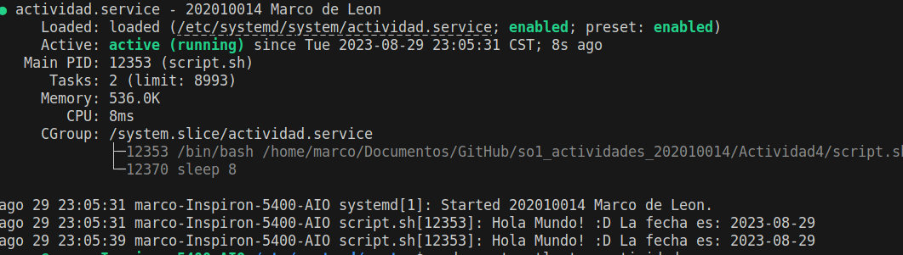

# Marco Alexander de León Hernández
## 202010014
### Actividad 4 - Servicio con Systemd en Linux

En esta actividad, configuramos un servicio con systemd que se encarga de imprimir un saludo junto con la fecha actual.

## Pasos para la configuración del servicio:

### 1. Creación del Script de Saludo

Escribimos un script que imprime un mensaje de saludo y muestra la fecha actual.

```bash
#!/bin/bash
fecha_actual=$(date +"%Y-%m-%d")
while true; do
    echo "Hola Mundo! :D La fecha es: $fecha_actual"
    sleep 8  
done
 ```

### 2. Otorgar permisos al script

Para asegurarnos de que el script sea ejecutable, le otorgamos los permisos necesarios:

```bash
sudo chmod +x script.sh
```

### 3. Preparación del servicio en Systemd

Nos desplazamos al directorio donde systemd administra sus servicios:

```bash
cd /etc/systemd/system/
```

### 4. Creación del descriptor del servicio

Creamos un nuevo archivo que systemd utilizará para entender cómo ejecutar nuestro script:

```bash
sudo nano actividad.service
```

### 5. Configuración del descriptor del servicio

Editamos el archivo para definir la estructura del servicio:

```bash
sudo nano actividad.service
```

Dentro del archivo, establecemos las siguientes directrices:

```
[Unit]
Description=202010014 Marco de Leon 


[Service]
ExecStart=/home/marco/Documentos/GitHub/so1_actividades_202010014/Actividad4/script.sh
User=marco

[Install]
WantedBy=multi-user.target
```


### 6. Recarga de systemd

Para que systemd reconozca nuestro nuevo servicio, recargamos la configuración:

```bash
sudo systemctl daemon-reload
```

### 7. Habilitación del servicio

Para que el servicio se inicie automáticamente en el arranque:

```bash
sudo systemctl enable actividad.service
```

### 8. Ejecución manual del servicio

Si deseas iniciar el servicio sin reiniciar tu máquina:

```bash
sudo systemctl start actividad.service
```

### 9. Monitoreo del servicio

Para verificar que el servicio esté funcionando correctamente:

```bash
sudo systemctl status actividad.service
```

### 10. Salida esperada

El servicio debería imprimir el saludo y la fecha cada 8 segundos. 


### 11. Detener el servicio

Si en algún momento deseas detener el servicio:

```bash
sudo systemctl stop actividad.service
```
